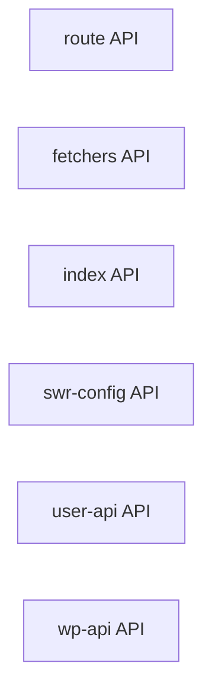

# API Integration

This diagram shows how components interact with API endpoints.

```mermaid
flowchart LR
    route["route API"]
    route["route API"]
    route["route API"]
    route["route API"]
    route["route API"]
    route["route API"]
    route["route API"]
    route["route API"]
    route["route API"]
    route["route API"]
    fetchers["fetchers API"]
    fetchers["fetchers API"]
    index["index API"]
    index["index API"]
    swr-config["swr-config API"]
    swr-config["swr-config API"]
    user-api["user-api API"]
    user-api["user-api API"]
    wp-api["wp-api API"]
    wp-api["wp-api API"]
    wp-api["wp-api API"]
    route["route API"]
    route["route API"]
    route["route API"]
    route["route API"]
    route["route API"]
    route["route API"]
    route["route API"]
    route["route API"]
    route["route API"]
    route["route API"]
    route["route API"]
    route["route API"]
    route["route API"]
    route["route API"]
    route["route API"]
    route["route API"]
    route["route API"]
    route["route API"]
    route["route API"]
    route["route API"]
    route["route API"]
    route["route API"]
    route["route API"]
    route["route API"]
    route["route API"]
    route["route API"]
    route["route API"]
    route["route API"]
    route["route API"]
    route["route API"]
    route["route API"]
    route["route API"]
    route["route API"]
    route["route API"]
    route["route API"]
    route["route API"]
    route["route API"]
    route["route API"]
    route["route API"]
    route["route API"]
    route["route API"]
    route["route API"]
    route["route API"]
    route["route API"]
    route["route API"]
    route["route API"]
    route["route API"]
    route["route API"]
    route["route API"]
```