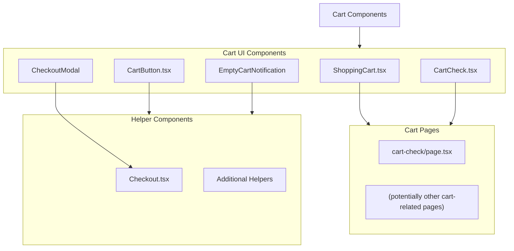

# Component Hierarchies & User Interface

## CartContext Component Hierarchy

```mermaid
flowchart TD
    cartComponents["Cart Components"]
    
    subgraph components["Cart UI Components"]
      ShoppingCart["ShoppingCart.tsx"]
      CartCheck["CartCheck.tsx"]
      CartButton["CartButton.tsx"]
      EmptyCartNotification["EmptyCartNotification"]
      CheckoutModal["CheckoutModal"]
    end
    
    subgraph pages["Cart Pages"]
      cartPage["cart-check/page.tsx"]
      otherPages["(potentially other cart-related pages)"]
    end
    
    subgraph helpers["Helper Components"]
      Checkout["Checkout.tsx"]
      additionalHelpers["Additional Helpers"]
    end
    
    cartComponents --> components
    ShoppingCart --> pages
    CartCheck --> pages
    CartButton --> helpers
    EmptyCartNotification --> helpers
    CheckoutModal --> Checkout
```

