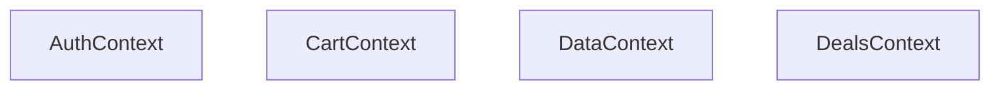

# Data Flow

This diagram shows how data flows through the application via context providers.

```mermaid
flowchart TD
    AuthContext["AuthContext"]
    AuthContext["AuthContext"]
    AuthContext["AuthContext"]
    CartContext["CartContext"]
    CartContext["CartContext"]
    CartContext["CartContext"]
    CartContext["CartContext"]
    CartContext["CartContext"]
    CartContext["CartContext"]
    CartContext["CartContext"]
    CartContext["CartContext"]
    DataContext["DataContext"]
    DataContext["DataContext"]
    DataContext["DataContext"]
    DataContext["DataContext"]
    DataContext["DataContext"]
    DataContext["DataContext"]
    DataContext["DataContext"]
    DealsContext["DealsContext"]
    DealsContext["DealsContext"]
```