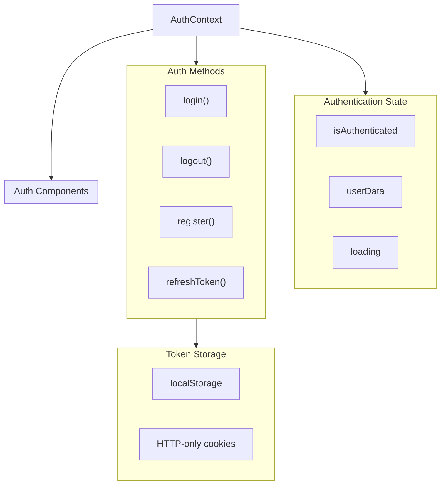
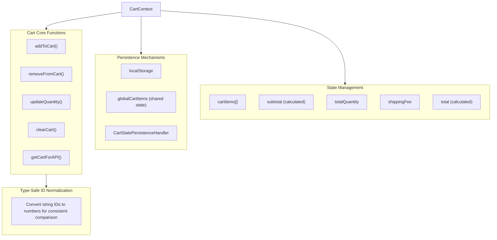
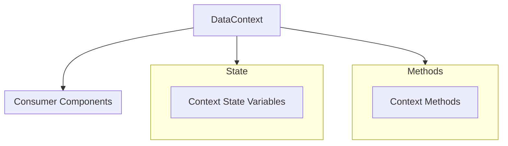
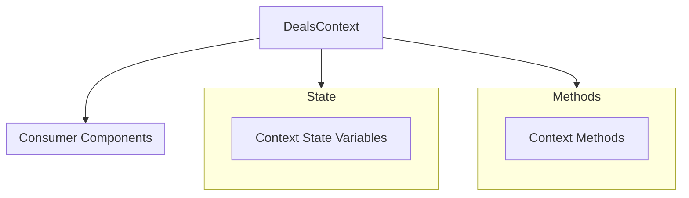
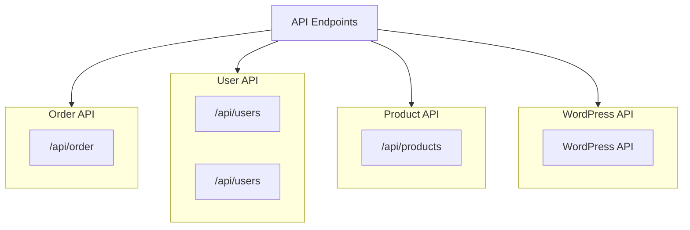

# Data & State Management Diagrams

## AuthContext Authentication Flow

## CartContext Data Structure & State Management

## DataContext Context Flow

## DealsContext Context Flow

## API Integration

