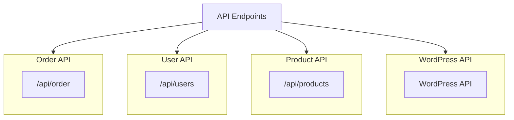

# Data & State Management Diagrams

## API Integration

```mermaid
flowchart TD
    apiEndpoints["API Endpoints"]
    
    subgraph orderApi["Order API"]
      orderEndpoint["/api/order"]
    end
    
    subgraph userApi["User API"]
      userEndpoint["/api/users"]
    end
    
    subgraph productApi["Product API"]
      productEndpoint["/api/products"]
    end
    
    subgraph wpApi["WordPress API"]
      wpEndpoint["WordPress API"]
    end
    
    apiEndpoints --> orderApi
    apiEndpoints --> userApi
    apiEndpoints --> productApi
    apiEndpoints --> wpApi
```

