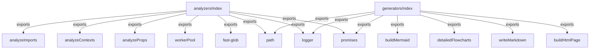

# Index Structure

This diagram shows the structure of index files and what they export.

```mermaid
flowchart TD
    analyzers["analyzers/index"]
    analyzeImports["analyzeImports"]
    analyzers -->|exports| analyzeImports
    analyzeContexts["analyzeContexts"]
    analyzers -->|exports| analyzeContexts
    analyzeProps["analyzeProps"]
    analyzers -->|exports| analyzeProps
    workerPool["workerPool"]
    analyzers -->|exports| workerPool
    fast-glob["fast-glob"]
    analyzers -->|exports| fast-glob
    path["path"]
    analyzers -->|exports| path
    logger["logger"]
    analyzers -->|exports| logger
    promises["promises"]
    analyzers -->|exports| promises
    generators["generators/index"]
    path["path"]
    generators -->|exports| path
    promises["promises"]
    generators -->|exports| promises
    logger["logger"]
    generators -->|exports| logger
    buildMermaid["buildMermaid"]
    generators -->|exports| buildMermaid
    detailedFlowcharts["detailedFlowcharts"]
    generators -->|exports| detailedFlowcharts
    writeMarkdown["writeMarkdown"]
    generators -->|exports| writeMarkdown
    buildHtmlPage["buildHtmlPage"]
    generators -->|exports| buildHtmlPage
```