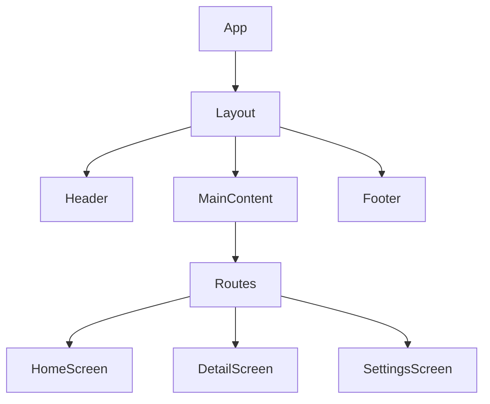
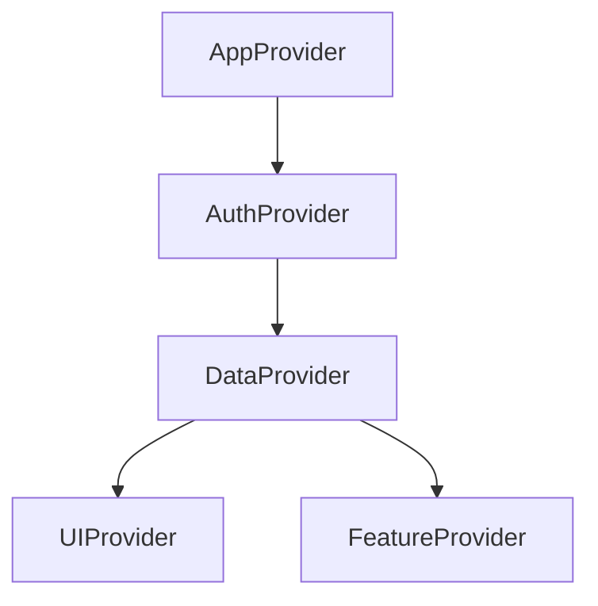
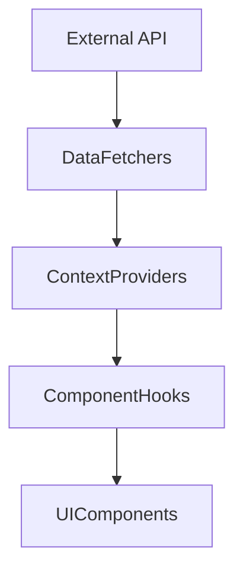

# Project Name Detailed Architecture

## Component Hierarchy

The application follows a hierarchical component structure:

## Context Relationships

Context providers are organized hierarchically:

## Data Flow Diagrams

Data flows through the application as follows:

## Key Abstractions

The application uses these key abstractions:

1. **Context Providers** - Abstract state management
2. **Custom Hooks** - Abstract complex logic and side effects
3. **API Clients** - Abstract external service communication
4. **UI Components** - Abstract presentation logic

## API Integration Points

The application integrates with external services through these points:

1. **Auth API** - User authentication and authorization
2. **Data API** - Core application data
3. **Analytics API** - User behavior tracking
4. **Notification API** - User notifications

## Advanced Patterns

Advanced patterns used in the codebase:

1. **Compound Components** - Components that work together as a system
2. **Render Props** - Components that take a function as a prop
3. **State Machines** - Managing complex state transitions
4. **Optimistic Updates** - Updating UI before API confirmation
