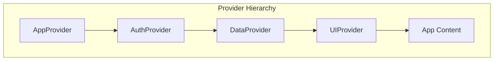
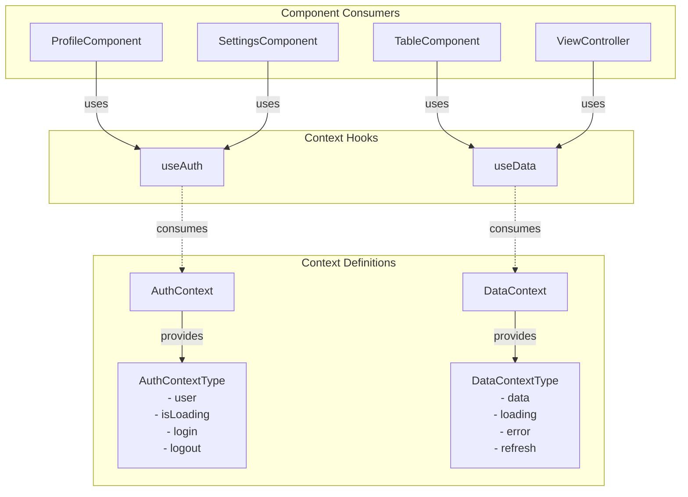
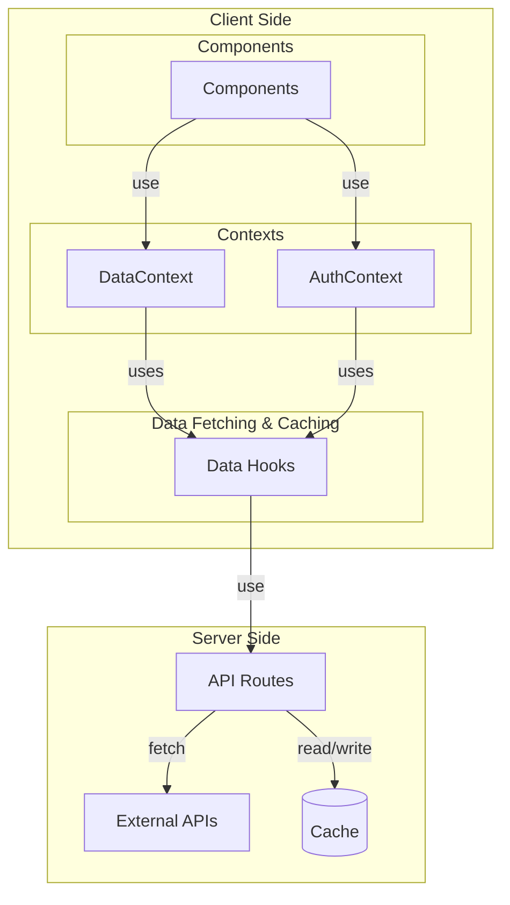
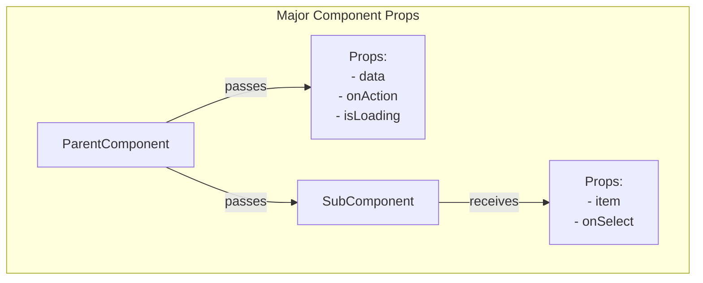
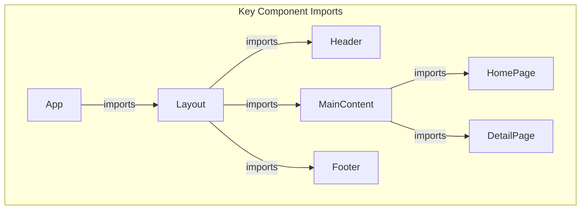
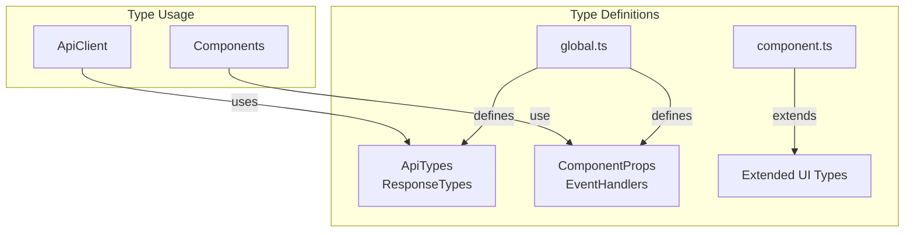

# Project Name Codebase Dependency Map

This document provides a comprehensive visualization of the dependencies and relationships between files, contexts, and components in the application.

## Context Providers

The application uses 0 main context providers to manage state:

1. **AppProvider** - Main application state
2. **AuthProvider** - Authentication state
3. **DataProvider** - Data management

## Provider Hierarchy

## Context APIs and Consumers

## Data Flow

## Component Prop Flow

## Key Component Dependencies

## Data Types Flow

## Key Files and Their Purpose

| File | Purpose | Key Dependencies |
|------|---------|------------------|
| `App.tsx` | Main application entry | Router, Providers |
| `Layout.tsx` | Application layout | Header, Footer |
| `AuthContext.tsx` | Authentication state | API client |
| `DataContext.tsx` | Data state management | API client, caching |
| `useAuth.ts` | Authentication hook | AuthContext |
| `useData.ts` | Data hook | DataContext |
