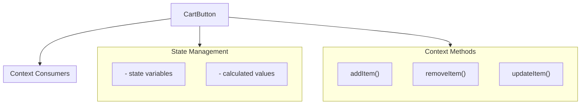

# CartButton Structure

```mermaid
flowchart TD
  CartButton["CartButton"]

  subgraph state["State Management"]
    direction TB
    state1["- state variables"]
    state2["- calculated values"]
  end

  subgraph methods["Context Methods"]
    direction TB
    method1["addItem()"]
    method2["removeItem()"]
    method3["updateItem()"]
  end

  subgraph consumers["Context Consumers"]
    direction TB
  end

  CartButton --> state
  CartButton --> methods
  CartButton --> consumers
```
