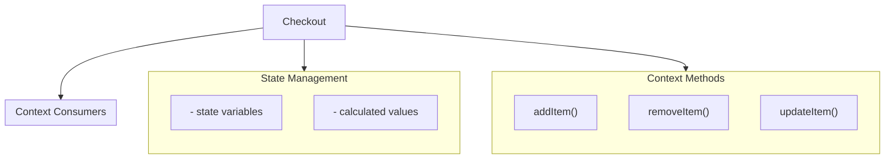

# Checkout Structure

```mermaid
flowchart TD
  Checkout["Checkout"]

  subgraph state["State Management"]
    direction TB
    state1["- state variables"]
    state2["- calculated values"]
  end

  subgraph methods["Context Methods"]
    direction TB
    method1["addItem()"]
    method2["removeItem()"]
    method3["updateItem()"]
  end

  subgraph consumers["Context Consumers"]
    direction TB
  end

  Checkout --> state
  Checkout --> methods
  Checkout --> consumers
```
