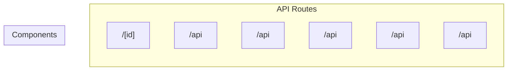

# API Integration

```mermaid
flowchart TD
  subgraph APIs["API Routes"]
    direction TB
    route["/monitoring"]
    route["/order"]
    fetchers["/api"]
    index["/api"]
    swr_config["/api"]
    user_api["/api"]
    wp_api["/api"]
    route["/products"]
    route["/clear-cache"]
    route["/metrics"]
    route["/[id]"]
    route["/users"]
    route["/customer"]
    route["/category"]
    route["/[id]"]
    route["/reset"]
    route["/[id]"]
    route["/me"]
    route["/logout"]
    route["/send-otp"]
    route["/verify-otp"]
    route["/[id]"]
  end

  subgraph Components["Components"]
    direction TB
  end

```
