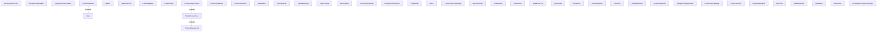

# Component Hierarchy

```mermaid
flowchart TD
  BackgroundFetcher["BackgroundFetcher"]
  BrowseViewWrapper["BrowseViewWrapper"]
  CategorySelectionMain["CategorySelectionMain"]
  ConditionalHero["ConditionalHero"]
  Header["Header"]
  HeaderSearch["HeaderSearch"]
  Hero["Hero"]
  ProductBadges["ProductBadges"]
  ProductBreadcrumb["ProductBreadcrumb"]
  ProductCard["ProductCard"]
  ProductPageContent["ProductPageContent"]
  ProductQuickView["ProductQuickView"]
  ProductsListMain["ProductsListMain"]
  SaleRibbon["SaleRibbon"]
  ShoppingCart["ShoppingCart"]
  SingleProductView["SingleProductView"]
  UserDashboard["UserDashboard"]
  OrderHistory["OrderHistory"]
  PersonalInfo["PersonalInfo"]
  ConfirmationModal["ConfirmationModal"]
  EmptyCartNotification["EmptyCartNotification"]
  HelpModal["HelpModal"]
  Menu["Menu"]
  ProductSearchManager["ProductSearchManager"]
  SearchResults["SearchResults"]
  ShareModal["ShareModal"]
  ShineEffect["ShineEffect"]
  SwipeToAction["SwipeToAction"]
  noteModal["noteModal"]
  AuthButton["AuthButton"]
  UserAuthModal["UserAuthModal"]
  Checkout["Checkout"]
  CheckoutModal["CheckoutModal"]
  BrowseViewMain["BrowseViewMain"]
  CategoryNavigationBar["CategoryNavigationBar"]
  ProductCardWrapper["ProductCardWrapper"]
  ProductSection["ProductSection"]
  DealsDebugPanel["DealsDebugPanel"]
  DevTools["DevTools"]
  AddressModal["AddressModal"]
  CartButton["CartButton"]
  CartCheck["CartCheck"]
  CartStatePersistenceHandler["CartStatePersistenceHandler"]
  EmptyCartNotification["EmptyCartNotification"]
  ConditionalHero -->|includes| Hero
  ProductPageContent -->|includes| SingleProductView
  SingleProductView -->|includes| ProductBreadcrumb
```
