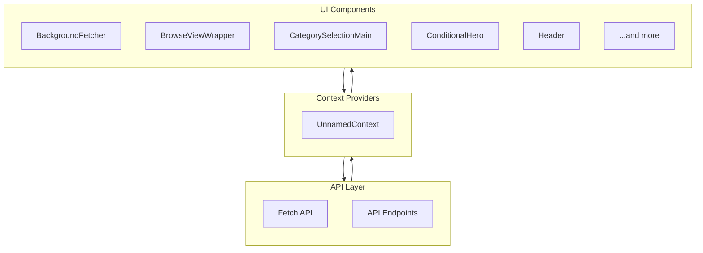

# Data Flow

```mermaid
flowchart TD
  subgraph Contexts["Context Providers"]
    direction TB
    UnnamedContext["UnnamedContext"]
  end

  subgraph API["API Layer"]
    direction TB
    fetch["Fetch API"]
    endpoints["API Endpoints"]
  end

  subgraph UI["UI Components"]
    direction TB
    BackgroundFetcher["BackgroundFetcher"]
    BrowseViewWrapper["BrowseViewWrapper"]
    CategorySelectionMain["CategorySelectionMain"]
    ConditionalHero["ConditionalHero"]
    Header["Header"]
    more["...and more"]
  end

  Contexts --> API
  API --> Contexts
  Contexts --> UI
  UI --> Contexts
```
