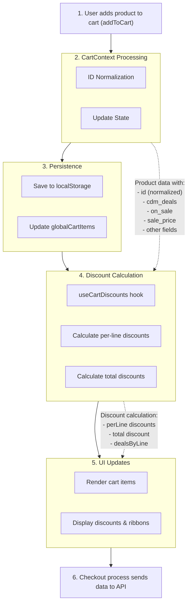
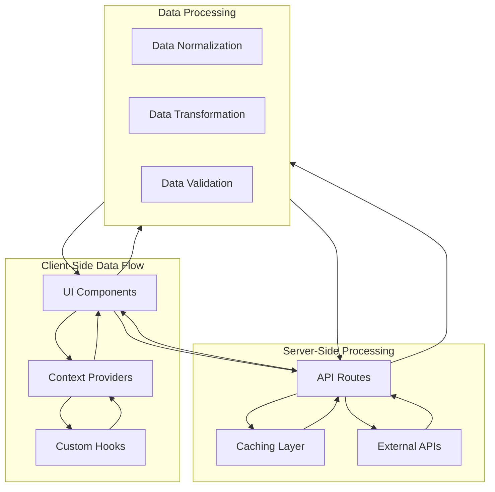
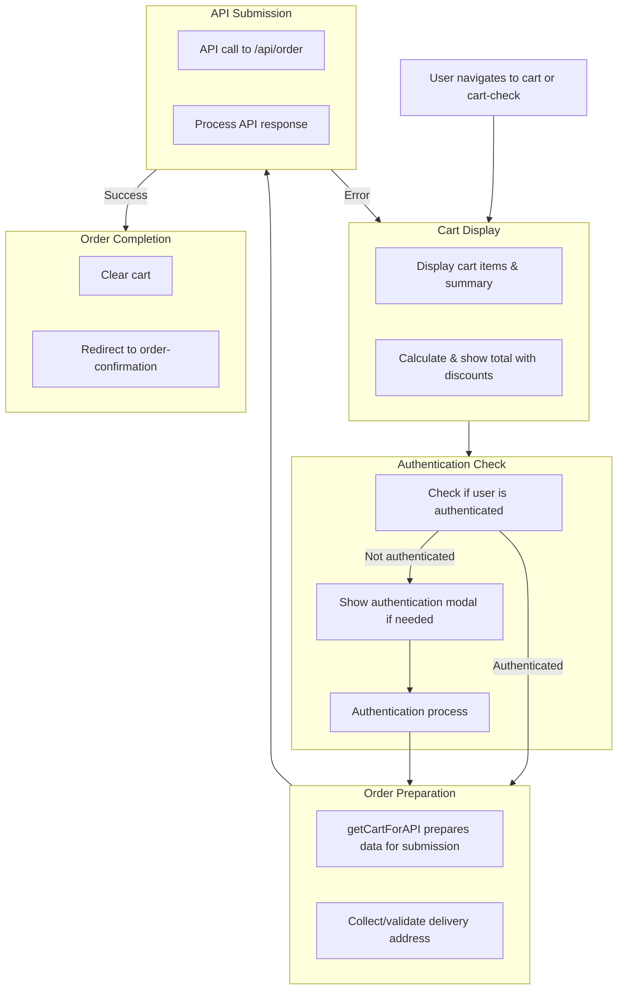

# User Flows & Features

## CartContext Data Flow

```mermaid
flowchart TD
    userAction["1. User adds product to cart (addToCart)"]
    
    subgraph contextUpdate["2. CartContext Processing"]
      normalizeId["ID Normalization"]
      updateState["Update State"]
    end
    
    subgraph persistence["3. Persistence"]
      saveLocal["Save to localStorage"]
      updateGlobal["Update globalCartItems"] 
    end
    
    subgraph discount["4. Discount Calculation"]
      useCartDiscounts["useCartDiscounts hook"]
      calculatePer["Calculate per-line discounts"]
      calculateTotal["Calculate total discounts"]
    end
    
    subgraph ui["5. UI Updates"]
      renderCart["Render cart items"]
      showDiscounts["Display discounts & ribbons"]
    end
    
    checkout["6. Checkout process sends data to API"]
    
    userAction --> contextUpdate
    contextUpdate --> persistence
    persistence --> discount
    discount --> ui
    ui --> checkout
    
    contextUpdate -.-> |"Product data with:
- id (normalized)
- cdm_deals
- on_sale
- sale_price
- other fields"| discount
    
    discount -.-> |"Discount calculation:
- perLine discounts
- total discount
- dealsByLine"| ui
```

## Application Data Flow

```mermaid
flowchart TD
    subgraph clientSide["Client-Side Data Flow"]
      contexts["Context Providers"]
      components["UI Components"]
      hooks["Custom Hooks"]
    end
    
    subgraph serverSide["Server-Side Processing"]
      apiRoutes["API Routes"]
      cache["Caching Layer"]
      external["External APIs"]
    end
    
    contexts --> components
    components --> contexts
    
    contexts --> hooks
    hooks --> contexts
    
    components --> apiRoutes
    apiRoutes --> components
    
    apiRoutes --> cache
    cache --> apiRoutes
    
    apiRoutes --> external
    external --> apiRoutes
    
    subgraph dataProcessing["Data Processing"]
      normalization["Data Normalization"]
      transformation["Data Transformation"]
      validation["Data Validation"]
    end
    
    components --> dataProcessing
    dataProcessing --> components
    
    apiRoutes --> dataProcessing
    dataProcessing --> apiRoutes
```

## Checkout Process

```mermaid
flowchart TD
    start["User navigates to cart or cart-check"]
    
    subgraph cartDisplay["Cart Display"]
      showItems["Display cart items & summary"]
      showTotal["Calculate & show total with discounts"]
    end
    
    subgraph authCheck["Authentication Check"]
      checkAuth["Check if user is authenticated"]
      showAuthModal["Show authentication modal if needed"]
      processAuth["Authentication process"]
    end
    
    subgraph orderPrep["Order Preparation"]
      prepareCart["getCartForAPI prepares data for submission"]
      collectAddress["Collect/validate delivery address"]
    end
    
    subgraph apiSubmission["API Submission"]
      submitOrder["API call to /api/order"]
      handleResponse["Process API response"]
    end
    
    subgraph completion["Order Completion"]
      clearCart["Clear cart"]
      showConfirmation["Redirect to order-confirmation"]
    end
    
    start --> cartDisplay
    cartDisplay --> authCheck
    
    checkAuth -->|Authenticated| orderPrep
    checkAuth -->|Not authenticated| showAuthModal
    showAuthModal --> processAuth
    processAuth --> orderPrep
    
    orderPrep --> apiSubmission
    apiSubmission -->|Success| completion
    apiSubmission -->|Error| cartDisplay
```

